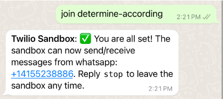

# Phone_Demon_Prototype

- In collaboration with Anna, Alyse, Lumina, Thurmann, and myself

##### (Video links to google drive video)

# How to Play with the Phone Demon

## 1) Connect to the WhatsApp Sandbox

### And text "join determine-according" to the sandbox number

## 2) Send a text message to the above number on WhatsApp

## 3) Continue to text the demon to receive various fortunes

## 4) Decode the secret message hidden in the various text messages (the pattern\* reveal “Azheklir” if you play long enough)

## 5)Text the secret name “Azheklir” to summon the demon and receive a special message

**_\* In some of the text messages, a word will be in all CAPS except for a single letter. These letters are meant to be gathered and then ordered based on the index number of the response. Not every message will contain a secret letter._**

**_EX: 18: HArBINGER, the ‘r’ would be the letter to keep track of, and its value would be 18._**

##### Decoded Key (for reference):

##### 1&nbsp; 4&nbsp; 5&nbsp; 6&nbsp; 11 12 16 18

##### a&nbsp; z &nbsp;h&nbsp; e&nbsp; k &nbsp;l &nbsp;&nbsp; i &nbsp;&nbsp; r

# Prototyping Question

The heart of our question is how to best make people uncomfortable or paranoid by using phones. Can the act of using a phone be dreadful? We plan to test what aspects of using a phone can make us paranoid if the call itself is the most important for causing paranoia, something on the phone itself (like a text message), or the way the user feels physically when they interact with it. We will test this with a few different prototypes, one that has creepy texts, one that involves dialing a rotary phone, and one that involves trying to make you afraid to check your phone.

### What we discovered

We learned that phones are actually very useful tools for making people feel paranoid, and the added layer of fortune creepiness was definitely a nice bonus. The “how” part of our question was answered in various ways by our prototypes, as each brought a different type of paranoia to the table. Whereas the Phone Bot Texting made the player feel unsettled as they texted a creepy entity, the Group Messaging Prototype added a combined competitive edge driving players to want to make other players feel paranoid about checking their phones. The Rotary Phone prototype gave an unsettling edge through prescribed phone numbers from a call list, the nature of it being an old rotary phone, and its randomly selected fortunes felt almost like bad omens when delivered in this format with its unsettling auditory quality.

If we were to try to use the various prototypes that we created, we would probably aim to create a point-and-click horror adventure with a heavy focus on the atmosphere. We could use all of the prototypes to create an ARG horror game. The rotary phone would be a great way to have a digital game component to it and require the players to test the clues that they got from interacting with the text-based prototypes. Adding the group chat/competitive aspect to it could make for an interesting mechanic, and could be narratively explained by various treasure hunters all racing to find a lost artifact of eldritch origin.
